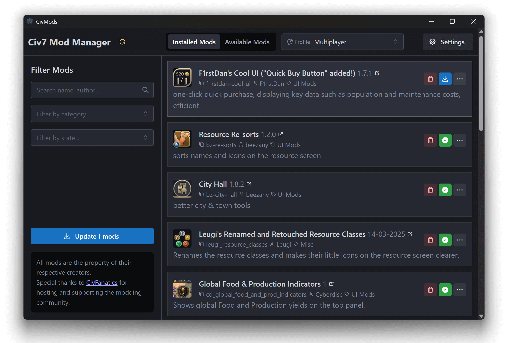

# CivMods

Unofficial Civ7 Mods Manager



## Develop

Download and Start Pocketbase v0.25.9 in `./apps/backend`:

```bash
./apps/backend/pocketbase.exe serve
```

Start the server

```bash
npm run -w @civmods/api dev
```

Start the Desktop App in `./apps/desktop`:

```bash
npm run -w @civmods/desktop tauri dev
```

To update PocketBase Typescript types:

```bash
npx pocketbase-typegen --db ./apps/backend/pb_data/data.db --out ./packages/parser/src/pocketbase-types.ts
```

### Local Import

To update local pocketbase and test the import script. Make sure to configure
the `POCKETBASE_TOKEN` variable in the .env file and to set the parameters in the
script.

```bash
npx tsx --env-file=.env ./apps/api/src/scripts/import-fanatics-mods.ts
```

## Contributors

- [leonardfactory](https://github.com/rockfactory)
- [haruleekim](https://github.com/haruleekim)
